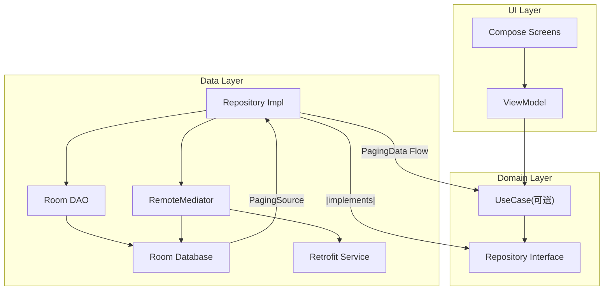

# Infinite Muse - Android Clean Architecture Gallery

**Infinite Muse** 是一個展示 Android 現代化開發最佳實踐的圖片瀏覽器 App。

本專案旨在演示如何在中型規模的應用中，透過 **Clean Architecture** 與 **MVVM** 模式，整合 **Paging 3**、**Room** 與 **Retrofit** 來實現穩健的「離線優先 (Offline-First)」架構，並結合 **Jetpack Compose** 與 **Material 3** 打造流暢且沉浸的使用者體驗。

### Architecture & Data (架構與數據)
*   **Clean Architecture**: 遵守分層原則 (Domain, Data, Presentation(UI))，確保業務邏輯與框架解耦。
*   **Offline-First**: 透過 **Paging 3 RemoteMediator** 實作網路與本地資料庫的單一來源 (SSOT)，支援離線瀏覽。
*   **Dependency Injection**: 使用 **Hilt** 進行依賴注入。
*   **Reactive Data Flow**: 使用 **Kotlin Flow** 與 **Coroutines**。

### UI & UX (介面與體驗)
*   使用 **Jetpack Compose** + **Material Design 3**
*   實作 **Edge-to-Edge** 全螢幕瀏覽，圖片穿透狀態列。
*   支援列表至詳情頁的無縫 **共享元素轉場(Shared Element Transition)** 動畫 (Compose 1.7+)。
*   使用圖片色調作為載入前佔位符，並實作點擊微交互。
*   支援深色/淺色模式切換及動態取色。(Android 12+)

## Tech Stack (技術棧)

*   **Language**: Kotlin
*   **UI Toolkit**: Jetpack Compose (Material 3)
*   **Navigation**: Navigation Compose (Type-safe)
*   **Async Image**: Coil
*   **DI**: Hilt
*   **Network**: Retrofit, OkHttp, Moshi
*   **Database**: Room
*   **Pagination**: Paging 3
*   **Testing**: JUnit 4, Mockk, Kotlinx Coroutines Test

## Architecture Overview (架構圖)



## Setup & Build (如何執行)

本專案使用 [Unsplash Developers](https://unsplash.com/developers) 的API

1.  在專案根目錄建立或開啟 `local.properties` 檔案。
2.  新增以下設定：

```properties
UNSPLASH_ACCESS_KEY=您的_API_KEY_貼在這裡
```

3.  Sync Gradle 並執行專案。
